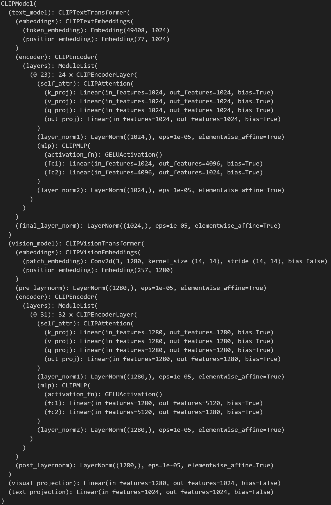

# Multimedia Final Image Retrieval

## Prerequisite
### Install necessary packages
```sh
pip install numpy pillow torch 'transformers[torch]' tqdm
```
### Download model (optional)
- [Epoch 1](https://drive.google.com/file/d/1tvDwD90b7J9FJeKbV5U4T5XdaheZEzgD/view?usp=sharing)

## Model
- Clip model detail
  
  
- Lock all layers parameters except for visual_projection layer. That is, we only fine-tune with this layer.